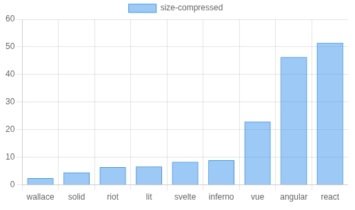
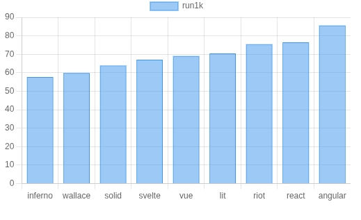

# Wallace

_The tiny framework that brings you FREEEDOM!!!_

[](https://npmjs.com/package/wallace) [](https://npmjs.com/package/wallace) [](https://npmjs.com/package/wallace)
 [](https://stackblitz.com/edit/wallace-js?file=src%2Findex.jsx)

## About

Wallace is a front end JavaScript framework for building:

- Web apps
- Mobile apps (using tools likes [Capacitator](https://capacitorjs.com/))
- Desktop apps (using tools like [Tauri](https://v2.tauri.app/))

It stands apart from [React](https://react.dev/), [Angular](https://angular.dev/), [Vue](https://vuejs.org/), [Svelte](https://svelte.dev/), [Solid](https://www.solidjs.com/) etc on three points:

1. **Performance**
2. **Productivity**
3. **Freedom**

### 1. Performance

Wallace is perhaps the fastest loading framework out there:



And DOM updates are pretty fast too:



But the truth is you rarely need _fast_. You just need to avoid _slow_ - which happens in more complex scenarios than benchmarks. And the only _real_ protection against that is **freedom** (see below).

### 2. Productivity

Wallace has several features which boost productivity:

1. Clean and compact syntax (~40% fewer lines of JSX than React).
2. Sensible reactivity - you control where and how.
3. Powerful inheritance & composition patterns.
4. Deep TypeScript support (if you want it).
5. Full documentation in IDE tool tips.

But the real win comes from what Wallace _lacks_:

##### No voodoo magic

Everything is clear, mechanical and obvious - even reactive behaviour.

##### No hidden engines

The rendering and DOM operations are so simple you can interact with them.

##### No awkward patterns

The object oriented design means you don't need hooks, portals, signals, providers, state handlers, context managers etc...

There's simply a lot less to learn, remember, wrangle with or accuse when things break. And that saves a _lot_ of time.

### 3. Freedom

Wallace sets up a tree of components, which are objects you can interact with, and whose methods you can override. There are no other objects in play. This makes Wallace the only truly "open" framework in that every behaviour and operation can be overridden.

This gives you full freedom to do anything really, but most likely:

- Run partial updates or direct DOM operations deep in the tree, cleanly and safely.
- Optimise further than any other framework - making it the best option for performance.
- Solve performance bottlenecks (which can hit any framework) with relative ease - making it the safest option all round.

You can't predict whether a project will hit one of these snags, how badly the framework will get in your way, how much time that will drain or how much time you'd have saved by using jQuery instead.

The only safe option is a fully open framework.

### Name

Wallace is named after [William Wallace](https://en.wikipedia.org/wiki/William_Wallace) (or rather his fictional portrayal in the film [Braveheart](https://www.imdb.com/title/tt0112573/)) because you can't say _freedom_ in Scotland without someone shouting _FREEDOM!!_ back at you, because of this scene :


## Status

Wallace is rather young, and hasn't been fully battle tested but:

1. You can override all behaviour at a granular level, which offers a degree of safety.
2. It is based on previous (unreleased) frameworks used in production for years on sites like [healthmatters.io](https://healthmatters.io).
3. You can attract more users and contributors by giving Wallace a ★

## Usage

Three quick ways to try Wallace:

1. Open a StackBlitz in [TypeScript](https://stackblitz.com/edit/wallace-ts?file=src%2Findex.tsx) or [JavaScript](https://stackblitz.com/edit/wallace-js?file=src%2Findex.jsx).
2. Load up one of the [examples](#Examples) below (on StackBlitz or locally).
3. Create a local project with:

```
npx create-wallace-app
```

Whichever you pick, you probably want to start by reading the cheat sheet by hovering over `"wallace"`:


There are more specific tool tips on most things, including JSX elements:


You might be able to find your way from there, if not read the [GUIDE](https://github.com/wallace-js/wallace/tree/master/GUIDE.md).

## Examples

These links open in [StackBlitz](https://stackblitz.com) so you can play around/fork/download a fully working project. If StackBlitz doesn't load, try to refresh, if not you can find all these in the [examples](https://github.com/wallace-js/wallace/tree/master/examples) directory.

- [Basic todo list (TypeScript)](https://stackblitz.com/fork/github/wallace-js/wallace/tree/master/examples/todo-basic)
- [Todo list with controller (TypeScript)](https://stackblitz.com/fork/github/wallace-js/wallace/tree/master/examples/todo-mvc)
- [Todo list with undo functionality (TypeScript)](https://stackblitz.com/fork/github/wallace-js/wallace/tree/master/examples/undo)

## Issues

Please open a ticket for any issue, including usage questions, as everything should be documented in tool tips and I'd want to know if its not.

## License

MIT.
