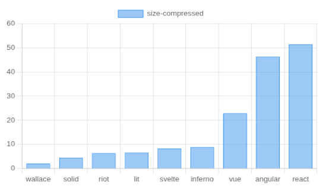
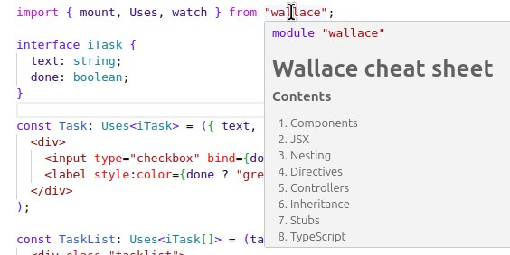
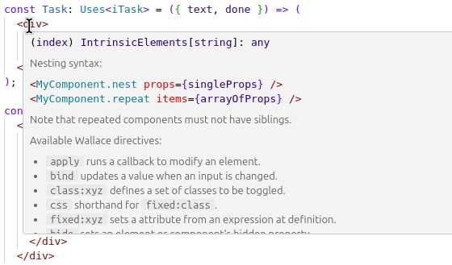

[](https://npmjs.com/package/wallace) [](https://npmjs.com/package/wallace) [](https://npmjs.com/package/wallace)  [](https://stackblitz.com/edit/wallace-js?file=src%2Findex.jsx)

# Wallace

An <strong><i>insanely</i></strong> small, fast, intuitive and extendable front-end framework.

The docs are in the process of being moved to the new homepage at https://wallace.js.org.

## About

Wallace is a brand new (2026) front end framework for building:

- Web apps of any size.
- Mobile apps - using tools likes [Capacitator](https://capacitorjs.com/).
- Desktop apps - using tools like [Tauri](https://v2.tauri.app/).

It outperforms popular frameworks like [React](https://react.dev/), [Angular](https://angular.dev/), [Vue](https://vuejs.org/), [Svelte](https://svelte.dev/) and [Lit](https://lit.dev/) on three points:

1. **Performance**
2. **Productivity**
3. **Freedom**

### 1. Performance

Wallace is perhaps the smallest (and hence fastest loading) framework out there. Here are the bundle sizes of some implementations of the [js-framework-benchmark](https://github.com/krausest/js-framework-benchmark) app:



This makes Wallace ideal for:

- Pages that need to load fast.
- Situations where processing power or connectivity are limited.
- Apps where users switch pages frequently (less need for an SPA, especially with PWA technology).

And its DOM operations are pretty fast too. Here is the time\* in milliseconds to create 1000 rows on the [js-framework-benchmark](https://github.com/krausest/js-framework-benchmark) app:


But benchmarks aren't always indicative of real-world performance, which is really limited by how much control you have over operations - and that's where Wallace really shines (see **freedom** below).

_\* Times are taken from local runs using non-keyed implementations of other frameworks where available. Will submit for an official run soon, which might change results slightly, but bundle sizes would be identical._

### 2. Productivity

Wallace helps you develop faster by being:

#### Sensible

- No weird syntax, just plain JavaScript + JSX.
- No awkward patterns like signals, hooks, context providers etc...
- No confusing magic - everything from reactivity to DOM updates are easy to _follow_ and easy to _control_.

#### Powerful

- Use controllers to keep your code simple and clean as your app grows.
- Easily run targeted updates for a smoother UI.
- Extend and override parts of components using the stubs system.

#### Helpful

- Deep TypeScript support.
- Compile time error-detection system.
- Tool tips everywhere (works in every modern IDE - no plugin required).

There's even a full cheat sheet on the module tool tip so you need never need to leave your IDE:



All this makes Wallace ideal for:

- Learning and teaching.
- People who don't touch the (front end) code very often.
- People who'd rather develop apps than learn a new framework.

### 3. Freedom

Wallace is potentially the only fully open framework which lets you override all run time behaviour at a granular level.

This gives you complete freedom to step out of the framework any time you like and take control without making a mess.

And this protects you from losing velocity in those sticky situations which frameworks don't handle well, which are often exacerbated by how difficult the framework makes finding a clean solution, leaving you with:

- A compromise on performance or features.
- A messy hack that yields more bugs every time something changes.
- A lot of time wasted looking for ways to avoid the above.

You might get lucky and never encounter these, but that's the thing about freedom: its easy to give it away thinking you'll never need it, until its too late.

#### It's all in the name

Wallace is named after [William Wallace](https://en.wikipedia.org/wiki/William_Wallace) - or rather his fictional portrayal in the film [Braveheart](https://www.imdb.com/title/tt0112573/), who made it impossible for people in Scotland to talk at any length about "freedom" without someone reenacting this scene:


## Usage

Assuming you're comfortable with ES6, you can probably learn Wallace in around 25 minutes, after which you can rely entirely on the tool tips.

### Installation

You can create an empty project with this script:

```
npx create-wallace-app
```

Or spin up a quick StackBlitz (choose [TypeScript](https://stackblitz.com/edit/wallace-ts?file=src%2Findex.tsx) or [JavaScript](https://stackblitz.com/edit/wallace-js?file=src%2Findex.jsx)). There are also [examples](https://github.com/wallace-js/wallace/tree/master/examples) which all have a [StackBlitz](https://stackblitz.com) link in their README so you can play around online, then download a fully working project.

To install into an existing project run:

```
npm i wallace -D
```

This also installs `babel-plugin-wallace` which you need to add to your **babel.config.cjs** or equivalent like so:

```js
module.exports = {
  plugins: ['babel-plugin-wallace', '@babel/plugin-syntax-jsx']
};
```

Then configure your bundler to apply those to jsx/tsx files. The [examples](https://github.com/wallace-js/wallace/tree/master/examples) all use webpack, so you can copy from there.

### Configuration

You can toggle flags in your babel config to disable certain features for cutting edge performance and bundle size:

1.  `allowBase` - allows use of `base` in components.
2.  `allowCtrl` - allows use of `ctrl` in components.
3.  `allowDismount` - allows components to handle dismounting.
4.  `allowMethods` - allows use of `methods` helper to components.
5.  `allowParts` - allows use of parts.
6.  `allowRepeaterSiblings` - allows repeaters to have siblings.
7.  `allowStubs` - allows use of stubs.

These flags default to true, unless you specify `flags` in the plugin config, in which case they default to false and you need to explicitly enable those you want. This helps you identify those you don't need to set:

```tsx
module.exports = {
  plugins: [
    [
      "babel-plugin-wallace",
      {
        flags: {
          allowCtrl: true,
          allowStubs: false
        },
      }
    ],
    "@babel/plugin-syntax-jsx"
  ],
  presets: ["@babel/preset-typescript", ...]
};
```

The types (and therefore tool tips) are unaffected by these flags, and will treat them
all as being true.

### Components

Wallace controls the DOM with components, which you define as functions that return JSX:

```tsx
const Counter = ({ count }) => (
  <div>
    <button onClick={count++}>{count}</button>
  </div>
);
```

During compilation the Babel plugin replaces such functions with generated functions which are used as constructors to create objects:

```tsx
const component = new Counter();
```

These objects (called component _instances_ or just _components_) have methods, like `render` which updates its DOM instantly:

```tsx
component.render({ count: 99 });
console.log(component.el); // <div><button>99</button></div>
```

You won't see anything on the page as `el` is not attached to the document.

Note that the function you see in your source code no longer exists at run time, so it never _runs_. It is just a placeholder for JSX, which gets _parsed_ during compilation. The function may only contain one JSX expression, and nothing else.

### Mounting

You don't create component objects yourself, instead you mount the component at the root of your tree, which then creates and mounts any nested components:

```tsx
import { mount } from 'wallace';

const Counter = ({ count }) => (
  <div>
    <button onClick={count++}>{count}</button>
  </div>
);

const CounterList = (counters) => (
  <div>
    <Counter.repeat props={counters} />
  </div>
);

mount('main', CounterList, [{ count: 0 }, { count: 0 }]);
```

> You should now see two buttons on the page, but clicking them doesn't do anything yet.

The `mount` helper function simply creates the root component, calls its `render` method, attaches it and returns it. Once it's done there's only components left, which manage their own DOM and nested components. There is no separate engine coordinating things, just components, which are normal objects.

### JSX

Instead of placing logic _around_ elements, you control structure from _within_ elements using directives (attributes with special behaviour) like `if`:

```tsx
const Counter = ({ count }) => (
  <div>
    <button onClick={count++}>{count}</button>
    <button if={count > 2} onClick={(count = 0)}>
      reset
    </button>
  </div>
);
```

And special syntax for nesting and repeating:

```tsx
const CounterList = (counters) => (
  <div>
    <Counter props={counters[0]} />
    <Counter.repeat props={counters} />
  </div>
);
```

This form reuses components sequentially, which may cause issues with CSS animations
and focus, in which case you should use a keyed repeater by passing `key` which can
be a string or a function:

```tsx
const TaskList = (tasks) => (
  <div>
    <Task.repeat props={tasks} key="id" />
  </div>
);

const TaskList = (tasks) => (
  <div>
    <Task.repeat props={tasks} key={(x) => x.id} />
  </div>
);
```

But you don't need to remember all this. JSX elements have a tool tip which reminds you of syntax rules and lists the available directives, which have their own tool tips detailing their usage:



### TypeScript

The `Uses` type specifies a component's props (and other things as we'll see later) which are best defined as an interface for clarity and reuse:

```tsx
import { mount, Uses } from 'wallace';

interface iCounter {
  count: number;
}

const Counter: Uses<iCounter> = ({ count }) => (
  <div>
    <button onClick={count++}>{count}</button>
  </div>
);

const CounterList: Uses<iCounter[]> = (counters) => (
  <div>
    <Counter props={counters[0]} />
    <Counter.repeat props={counters} />
  </div>
);

mount('main', CounterList, [{ count: 0 }]);
```

TypeScript now warns you if you attempt to pass incorrect props at any point. Try changing `count` to a rude word anywhere in the above and you'll see TypeScript swear back at you.

Don't annotate the props like this:

```tsx
const Counter = (props: iCounter) => (
  <div>
    <button onClick={props.count++}>{props.count}</button>
  </div>
);
```

That only works within that function, but not elsewhere as ensured by `Uses`.

### Rendering

For present purposes, the `render` method we've been calling does this:

```tsx
function render(props) {
  this.props = props;
  this.update();
}
```

So `props` is stored on the component instance, and gets reset every `render`, which seems pointless - except that components are used in two ways:

#### Dumb components

Components like `Counter` only display data and fire events, and should be stateless. So long as you only call their `render` method they are as good as stateless.

#### Controlling components

Components like `CounterList` are used to coordinate updates following changes to state/data, and making these stateless (as they are in React) means you need to use awful patterns like hooks to do anything.

With Wallace you simply override the render method and create a callback which updates that instance, and pass that wherever it's needed, for example:

```tsx
CounterList.prototype.render = function (props) {
  const update = () => this.update();
  this.props = props.map(c => {...c, update});
  this.update();
};
```

But that's a really ugly React-like approach which involves mutating props and their interface. Wallace has much cleaner approach using a "controller" as we'll see later.

Wallace also provides a neater and safer way to set properties on the prototype:

```tsx
CounterList.methods = {
  render(props) {
    this.props = props;
    this.update();
  },
  otherMethod() {}
};

// Doesn't delete existing properties
typeof CounterList.methods.update; // function
```

### Reactivity

To see reactivity working more clearly, let's display the total across all counters:

```tsx
const CounterList: Uses<iCounter[]> = (counters) => (
  <div>
    <span>Total: {counters.reduce((t, c) => t + c.count, 0)}</span>
    <Counter.repeat props={counters} />
  </div>
);
```

To make it "reactive" we use `watch` to replace the props with a [proxy](https://developer.mozilla.org/en-US/docs/Web/JavaScript/Reference/Global_Objects/Proxy) which calls a callback whenever it, or any nested object, is modified:

```tsx
import { watch } from 'wallace';

CounterList.methods = {
  render(props) {
    this.props = watch(props, () => this.update());
    this.update();
  }
};
```

> Clicking on a button updates its count and the total.

Some frameworks bake reactivity into the framework, or hide how it works. Wallace deliberately doesn't do this, because:

1. Once your app uses real data, you only need reactivity in very few places.
2. Its incredibly easy to cause unintended behaviour with reactivity (in all frameworks).

Wallace's explicit approach helps you:

- See exactly how it works.
- Control exactly what it updates.

This will save you many headaches further down the line.

### Binding

A major part of reactivity is binding data to inputs, which we do with the `bind` directive. To show this let's add a text box to name the things we're counting.

```tsx
interface iCounterList {
  counters: iCounter[];
  things: string;
}

const CounterList: Uses<iCounterList> = ({ counters, things }) => (
  <div>
    <span>
      Total {things}: {counters.reduce((t, c) => t + c.count, 0)}
    </span>
    <Counter.repeat props={counters} />
    <input type="text" bind={things} event:keyup />
  </div>
);

mount('main', CounterList, {
  things: 'sheep',
  counters: [{ count: 0 }, { count: 0 }]
});
```

> The UI displays `Total sheep: 0` and changes as you type in the input.

The `bind` directive normally responds to the `change` event, but we used a qualifier to change it to `keyup` so you don't need to leave the text box to see the change.

But there's an issue: the entire component updates every time you type in the text box. Even though there's no DOM change in the counters, that's still a load of unnecessary churn. You'd never notice it in a small demo, but might in a larger app.

Fortunately, this is very easy to resolve in Wallace, thanks to parts.

### Parts

Parts let you update sections of a component. Let's combine this with reading the arguments passed to the `watch` callback to only update the `span` as we type in the text box:

```tsx
const CounterList: Uses<iCounterList> = ({ counters, things }) => (
  <div>
    <span part:things>Total {things}: </span>
    <span>{counters.reduce((t, c) => t + c.count, 0)}</span>
    <Counter.repeat props={counters} />
    <input type="text" bind={things} even:keyup />
  </div>
);

CounterList.methods = {
  render(props) {
    this.props = watch(props, (target, key) => {
      key === 'things' ? this.part.things.update() : this.update();
    });
    this.update();
  }
};
```

> Typing in the text box only updates the span with things.

You can also access the raw DOM element, or nested component using `ref`:

```
<span ref:things>
```

However, you probably don't want to do access the DOM element this way. If you do need to access the element (for the handful of valid reasons you might want to) then you are better using the `apply` directive:

```tsx
const Counter: Uses<iCounter> = ({ count }, { element }) => (
  <div>
    <button apply={modifyBtn(element, count)} onClick={count++}>
      {count}
    </button>
  </div>
);

const modifyBtn = (element, count) => (element.disabled = count > 3);
```

The callback edits the button's `disabled` property, leaving its `textContent` to be managed by the component. The reason they don't clash is because this is exactly how the component updates components internally during `update`.

The reference to `element` came from an optional extra argument, known as xargs.

### Xargs

Remember: these functions aren't real, they are dismantled during compilation, so the arguments aren't real either. Wallace treats the first argument as the props, and uses the second argument to provide several useful variables:

##### element

A reference to the element in a callback that allows it. If you use it in multiple callbacks, it points to a different element in each:

```tsx
const Counter = (_, { element }) => (
  <div>
    <button apply={console.log(typeof element)}>+</button>
    <span apply={console.log(typeof element)}></span>
  </div>
);
```

##### event

A reference to the event in a callback that allows it. Like element, it points to different event in each callback. Both `event` and `element` can be type-coerced in place if the callback needs it:

```tsx
const Counter = (_, { event }) => (
  <div>
    <button onClick={foo(event as ClickEvent)}>+</button>
    <input onKeyUp={bar(event as KeyUpEvent)} />
  </div>
);

const foo = (event: ClickEvent) => {};
const bar = (event: KeyUpEvent) => {};
```

##### self

A reference to the component instance, useful for accessing methods:

```tsx
const Counter = ({ count }, { self }) => (
  <div>
    <button onClick={(count++, self.update())}>{count}</button>
  </div>
);
```

Unfortunately we can't use `this` in arrow functions, but have to use `this` in methods.

##### props

The props object, because you might want the destructured version for a callback or something:

```tsx
const Counter = ({ count, id }, { props }) => (
  <div>
    <button apply={foo(props)}>{count}</button>
  </div>
);
```

Of course you could equally access it as `self.props` but it's free to add so why not.

##### ctrl

The controller.

### Controllers

The `render` function _actually_ looks like this:

```tsx
function render(props, ctrl) {
  this.props = props;
  this.ctrl = ctrl;
  this.update();
}
```

You can provide a value for `ctrl` in the 4th argument to `mount`:

```tsx
const ctrl = {};
mount('main', CounterList, [], ctrl);
```

But you tend to set it in `render` instead, as you can access the component in functions attached to the controller, which is what they are for:

```tsx
CounterList.methods = {
  render(props) {
    this.props = watch(/*...*/);
    this.ctrl = {
      applyToAll: (count) =>
        this.props.forEach((c) => (c.count = count))
    };
    this.update();
  }
};
```

A component passes its own value as 2nd argument when calling `render` on nested components, which assuming they don't then set it to something else, means they all point to the same object, allowing them to call its functions:

```tsx
const Counter: Uses<iCounter> = ({ count }, { ctrl }) => (
  <div>
    <button onClick={count++}>{count}</button>
    <button onClick={ctrl.applyToAll(count)}>...</button>
  </div>
);
```

> Clicking the 2nd button sets all counters to the value of this counter.

This saves you having to shoehorn functions into props at every step like React which keeps things really clean: use props for data, and the controller for everything else.

It also helps performance as there's less mapping of arrays to shoehorn extra bits into each item.

### Controllers II

If `ctrl` is a plain object then you'll need create an interface to get type support for it, which you pass into the second slot of `Uses`:

```tsx
interface Controller {
  applyToAll: (number) => void;
}

const Counter: Uses<iCounter, Controller> = ({ count }, { ctrl }) => ();
const CounterList: Uses<iCounterList, Controller> = ({ count }) => ();
```

> We don't access `ctrl` in the `CounterList` JSX so might be tempted to omit it, but don't, as the type carries through to `this.ctrl` which we access in `render`, so that helps.

However, you don't need an interface if you turn your controller into a class, because the class is its own type. So let's do that and move all the logic over while we're at it:

```tsx
import { ComponentInstance, watch } from 'wallace';

class Controller {
  root: ComponentInstance<iCounterList>;
  constructor(
    root: ComponentInstance<iCounterList>,
    props: iCounterList
  ) {
    this.root = root;
    root.props = watch(props, (target, key) => {
      key === 'things' ? root.part.things.update() : root.update();
    });
  }
  applyToAll(count) {
    this.root.props.counters.forEach((c) => (c.count = count));
  }
}

CounterList.methods = {
  render(props) {
    this.ctrl = new Controller(this, props);
    this.update();
  }
};
```

The advantages of moving all your logic to controllers are:

1. Your component ends up so simple that it is unlikely to conceal errors.
2. Your logic is all inside non-framework code.
3. You can organise, inherit, inject or compose controllers or services whichever way you please.

Point 2 matters because your brain always assumes a framework has some "magic" to it, so when things go wrong and you can't tell why, you assume it relates to the framework.

Having your logic in plain JavaScript separate from any framework code eliminates that possibility, helping you debug quicker.

> Although `watch` comes from Wallace it has nothing to do with components or compilation, so there's less unknown. And if there is, you just add some logging to the callback.
>
> In fact, if you do that right now you'll find we've got another reactivity blip: `applyToAll` will update the `CounterList` once for every item in `counters`!

To fix this we can work with the original object, which doesn't trigger an update, then call `update` when we're done:

```tsx
class Controller {
  root: ComponentInstance<iCounterList>;
  counters: iCounter[];
  constructor(
    root: ComponentInstance<iCounterList>,
    props: iCounterList
  ) {
    this.root = root;
    this.counters = props.counters;
    root.props = watch(/*...*/);
  }
  applyToAll(count) {
    this.counters.forEach((c) => (c.count = count));
    this.root.update();
  }
}
```

Another thing we can do is watch different parts of the props with different callbacks:

```tsx
class Controller {
  /*...*/
  constructor(
    root: ComponentInstance<iCounterList>,
    props: iCounterList
  ) {
    this.root = root;
    this.counters = props.counters;
    root.props = {
      counters: watch(this.counters, () => root.update()),
      things: watch(props.things, () => root.part.things.update())
    };
  }
  /*...*/
}
```

Although this requires you to change the shape of `things` as you can only watch an object, not a string:

```tsx
interface iCounterList {
  counters: iCounter[];
  things: { value: string };
}
```

You would need to change how `things` are passed in `mount` and used in `CounterList`.

### Immutability

So far we've covered reactivity where we change the data in place, but once you're working with real data you don't want the UI changing it. You can protect data from accidental modification using the `protect` helper:

```tsx
import { protect, watch, ComponentInstance } from 'wallace';

class Controller {
  /*...*/
  constructor(
    root: ComponentInstance<iCounterList>,
    props: iCounterList
  ) {
    this.root = root;
    this.counters = props.counters;
    root.props = {
      counters: protect(this.counters),
      things: watch(props.things, () => root.part.things.update())
    };
  }
  /*...*/
}
```

> Clicking on the buttons now throws an error.

You would then change the buttons in `Counter` to call methods on the `Controller` which save the data to the API before updating the component, which we won't show here.

### Extending

To better illustrate extending components, let's pull the total calculation out to a method on the component. It should be moved to the controller, but it helps our case for now:

```tsx
interface Methods {
  total: () => number;
}

const CounterList: Uses<iCounterList, Controller, Methods> = (
  { counters, things },
  { self }
) => (
  <div>
    <span part:things>Total {things.value}: </span>
    <span>{self.total()}</span>
    <Counter.repeat props={counters} />
    <input type="text" bind={things.value} event:keyup />
  </div>
);

CounterList.methods = {
  render(props) {
    this.ctrl = new Controller(this, props);
    this.update();
  },
  total() {
    return this.props.counters.reduce((t, c) => t + c.count, 0);
  }
};
```

There's no escaping the need for an interface with component methods, but at least you don't need to add `render` and `update` as they are added in by `Uses`.

We can extend the `CounterList` using the `extendComponent` helper, which inherits the base's methods, and lets us override them if needed:

```tsx
import { extendComponent } from 'wallace';

const SpecialCounterList = extendComponent(CounterList);

SpecialCounterList.methods.render = function () {
  this.ctrl = new DifferentController(this, props);
  this.update();
};
```

You can also specify a new component definition function as the 2nd argument:

```tsx
const SpecialCounterList = extendComponent(
  CounterList,
  ({ counters, things }, { self }) => (
    <div>
      <Counter.repeat props={counters} />
      <span>Total: {self.total()}</span>
    </div>
  )
);
```

> The plugin treats this as a special case, so stick to this exact format, e.g. don't pass a variable as the 2nd argument.

You still inherit the methods, like `total` as before. But if you're going to do this kind of thing, you might want to use stubs.

### Stubs

Stubs let you implement parts of the DOM in derived components, or vice versa:

```tsx
const CounterList: Uses<iCounterList, Controller> = () => (
  <div>
    <stub:stats />
    <stub:counters />
  </div>
);

CounterList.stubs = {
  stats: (_, { self }) => (
    <span>Total: {self.total()}</span>
  ),
  counters: ({ counters }) => (
    <div>
      <Counter.repeat props={counters} />
    </div>
  )
);

const HighestCounterList = extendComponent(CounterList);

HighestCounterList.stubs.stats = ({ counters }) => (
  <span>Highest: {self.highest()}</span>
);

HighestCounterList.methods.highest = function () {
  return Math.max(...this.props.counters.map(c => c.count))
}
```

Component definitions inherit stubs much like prototype methods, and can override them, so `HighestCounterList` gets the same `counters` stub, but overrides the `stats` stub.

A base component does not have to implement all the stubs it references, though this makes it an abstract component definition.

A base component may also implement stubs it doesn't reference, and leave it to specific implementations to decide which it uses and where:

```tsx
const BaseCounterList = () => <div>OVERRIDE ME</div>;

BaseCounterList.stubs = {
  highest: (_, { self }) => <span>Highest: {self.highest()}</span>,
  total: (_, { self }) => <span>Total: {self.total()}</span>,
  counters: ({ counters }) => (
    <div>
      <Counter.repeat props={counters} />
    </div>
  )
};

BaseCounterList.methods = {
  total() {
    return this.props.counters.reduce((t, c) => t + c.count, 0);
  },
  highest() {
    return Math.max(...this.props.counters.map((c) => c.count));
  }
};

const HighestCounterList = extendComponent(BaseCounterList, () => (
  <div>
    <stub:counters />
    <hr />
    <stub:highest />
  </div>
));
```

> So long as the final component definition has an implementation (its own or inherited) for each stub it references, it will work.

Stubs are a flexible way to organise reusable component skeletons or parts, which again, helps reduce duplication, errors and bundle size.

### Router

Wallace comes with a very basic built-in Router which detects changes to the URL hash. It is mounted like a component and configured by props.

```tsx
import { mount, Router, route } from "wallace";

const routes = [
  route("/counter/{start:int}", Counter, ({ args }) => (count: args.start))
]
mount("main", Router, {routes});
```

> Going to http://localhost:8080/#/counter/5 will display a counter set to 5.

The 3rd argument to `route` is optional and converts the `RouteData` to props, which if omitted, will pass the object as-is. Here is `RouteData`:

```tsx
interface RouteData {
  args: { [key: string]: any }; // args extracted from the hash
  params: URLSearchParams; // Native URLSearchParams.
  url: string;
}
```

`route` also accepts a 4th argument which is a cleanup function that gets called when we navigate away from the page.

You can also configure attributes for the `div` and a custom error handler for not found pages etc:

```tsx
import { createComponent } from 'wallace';

const Error (message) => <div class="error">{message}</div>;

mount("main", Router, {
  atts: { id: "router", class: "danger" },
  error: (error, router) => (router.mount(createComponent(Error, error.message)),
  routes: []
});
```

## Status

Wallace is still in early development, and hasn't been very widely used, however:

1. There's not much framework at run time, and it's all simple, mechanical and close to the DOM.
2. You can override all behaviour.

This offers some degree of safety as you can hotfix errors in Wallace and remove that when its patched.

You can help make Wallace battle-ready by:

1. Using it ✔️
2. Filing bugs 🐞
3. Giving it a ★

## Issues

Please open a ticket for any issue, including usage questions, as everything should ideally be documented in tool tips.

## License

MIT.
