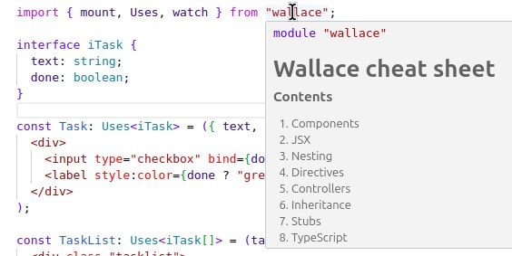

  

# Wallace

*The tiny framework that brings you FREEEDOM!!!*

## About

Wallace is a front end JavaScript framework for building:

- Web apps.
- Mobile apps (using tools likes [Capacitator](https://capacitorjs.com/))
- Desktop apps (using tools like [Tauri](https://v2.tauri.app/))

It stands apart from [React](https://react.dev/), [Angular](https://angular.dev/), [Vue](https://vuejs.org/), [Svelte](https://svelte.dev/), [Solid](https://www.solidjs.com/) and co on three points: **performance**, **productivity** and **freedom**.

### 1. Performance

Wallace is perhaps the fastest loading framework out there:

[img]

And DOM updates are pretty fast too:

[img]

But the truth about performance is that you rarely need *fast*. What matters is avoiding *slow* - which happens in more complex scenarios than benchmarks cover. And the only *real* protection against that is **freedom** (see below).

### 2. Productivity

Wallace has several features which boost productivity:

1. Clean and compact syntax (~40% fewer lines of JSX than React).
2. Sensible reactivity - you control where and how.
3. Flexible inheritance & composition patterns.
4. Deep TypeScript support.
5. Tool tips everywhere - including the full **cheat sheet** on the module import, so you need never leave your IDE:



But its biggest feature is that despite *feeling* like a functional React-like framework, it is actually object-oriented, which has several implications:

1. You do all the clever things (controlling state, responding to events, coordinating updates etc...) by overriding or adding methods.
2. So there's no need for awful patterns like hooks, portals, signals, providers, context managers etc... Wallace gives you components, nothing else.
3. So there's less framework to learn, remember, trip you up, or accuse while debugging.
4. You end up with more natural code that is easier to read, test, organise, modify and reuse.

These things significantly impact productivity.

### 3. Freedom

The object-oriented model lets you override *any* run time aspect, at a granular level. The direct DOM model lets you safely run manual DOM operations independently, alongside, or during automatic updates.

This means you can easily, cleanly and safely:

- Run partial updates deep in the tree.
- Pull of things like reparenting (which requires "portals" in React).
- Do anything that was possible without a framework.

The point is not to produce the fastest app, but to relax knowing you will be able to produce a timely, clean and safe solution to any bottleneck you encounter.

The problem with trading your freedom for convenience, is that you never know when you'll want your freedom back.

---

Wallace is named after [William Wallace](https://en.wikipedia.org/wiki/William_Wallace) - or rather his fictional portrayal in the 1995 movie [Braveheart](https://www.imdb.com/title/tt0112573/) whose battle cry "FREEDOM" has been immortalised in Scottish comedy culture ever since:


## Status

Wallace is rather young, and hasn't been fully battle tested but:

1. You can override all behaviour at a granular level, which offers a degree of safety.
2. It is based on previous (unreleased) frameworks used in production for years on sites like [healthmatters.io](https://healthmatters.io).
3. If you give it a star, it will rapidly attract more use, encounter more edge cases, and attract more development :-)

## Usage

Try it the browser in [TypeScript](https://stackblitz.com/edit/wallace-ts?file=src%2Findex.tsx) or [JavaScript](https://stackblitz.com/edit/wallace-js?file=src%2Findex.jsx), or create a local project with:

```
npx create-wallace-app
```

There is no tutorial yet, but its so simple you can figure it out from the tool tips. Read the cheat sheet by hovering over `"wallace"`:

```tsx
import { mount } from "wallace"
```

There are also examples in [packages/demos](./package/demos).

## Contributions

Yes.

## License

MIT
